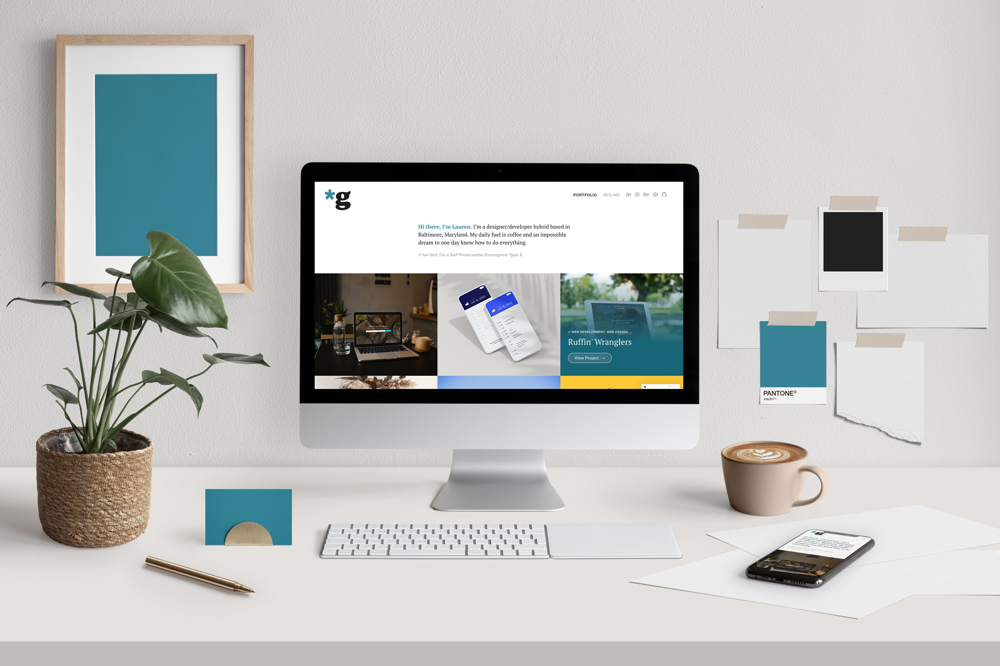

# Portfolio Website
It’s hard enough to keep up with updating a portfolio website when it’s built in a content management system, so it’s no surprise my past Github-based portfolios haven’t been updated as frequently as they should’ve been. My goal for my new site was to make adding new work as easy and efficient as possible so I could do it more often. Utilizing the Behance API, I was able to automatically pull my projects from my Behance Portfolio. As a designer, I’m expected to update both my portfolio website and my Behance portfolio regularly, so I decided this was the most efficient route to take. Now, when I make any updates on my Behance portfolio – whether I’m adding a new project or reordering existing projects – my portfolio site automatically updates with those changes.

     




## User Story
```
As a designer/developer
I want a low-maintenance, easy-to-update portfolio website
So that I can add new projects as quickly as possible
```


## Functionality
```
WHEN you first visit the page 
THEN only the project images display 
WHEN you hover over a project image 
THEN you can see the project name and category 
WHEN a project image is clicked 
THEN you’re taken to the full project on Behance 
WHEN I add new projects to my Behance portfolio 
THEN those projects automatically get added to my portfolio site 
WHEN I drag and drop projects within Behance to reorder them 
THEN the order automatically updates on my portfolio site 
WHEN you refresh the page 
THEN a new fun fact is displayed 
WHEN you hover over a fun fact 
THEN a gif related to that fun fact is displayed 
WHEN you begin to scroll down the page 
THEN the asterisk in my logo spins
```


## Table of Contents 
* [Usage](#usage)    
* [Questions](#questions) 
* [Donate](#donate)
* [License](#license) 


## Usage
* Navigate through projects:


* Generate random fun fact about me on page refresh:


* Asterisk rotates on page scroll:


## Questions
If you have any questions, feel free to find me at:
* Email: laurensiminski@gmail.com
* Website: https://siminski.co
* Github: [@siminski](https://github.com/siminski)


## Donate
Appreciate this code? Say thanks with a coffee:

[](https://ko-fi.com/W7W21YVJJ)


## License
Copyright (c) 2020 Lauren Siminski.